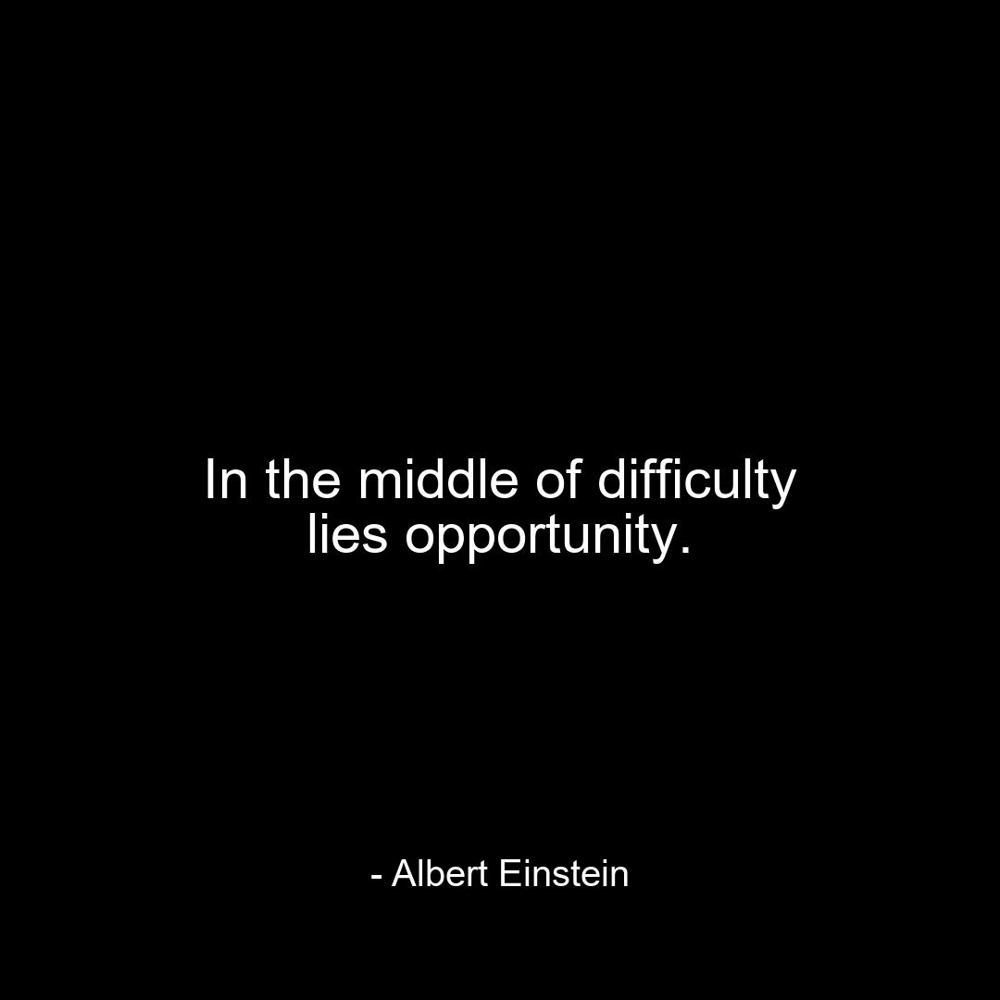

🚀✨ Instagram Automation Journey ✨🚀  

Consistency was always my dream — automation made it real.

I built a fully automated system that posts **one meaningful quote every single day**, completely hands-free. From generating quotes to designing images, writing captions, logging in, and posting — everything runs automatically without manual effort.

The system intelligently avoids duplicate quotes using an SQLite database, generates aesthetic quote images, creates engaging captions and hashtags using Gemini AI, and schedules daily posting through GitHub Actions with automatic Instagram login.

✨ OUTPUT PREVIEW — Auto-Generated Instagram Post ✨

::contentReference[oaicite:1]{index=1}

Every post you see above is automatically created — the quote, the image design, the caption, and the hashtags — then posted directly to Instagram without human intervention.

Powered by Python, Gemini API, SQLite, GitHub Actions, Instagrapi, and Pillow, this project transforms ideas into scalable systems and consistency into a habit.

🤖✨ Built for creators who believe automation fuels creativity.  
From late-night code to daily inspiration — fully automated.

👉 Follow the live output here:  
https://www.instagram.com/datavibe_hub/

Made with ❤️ by **Venkata Sai**  
Turning automation into real-world impact.
